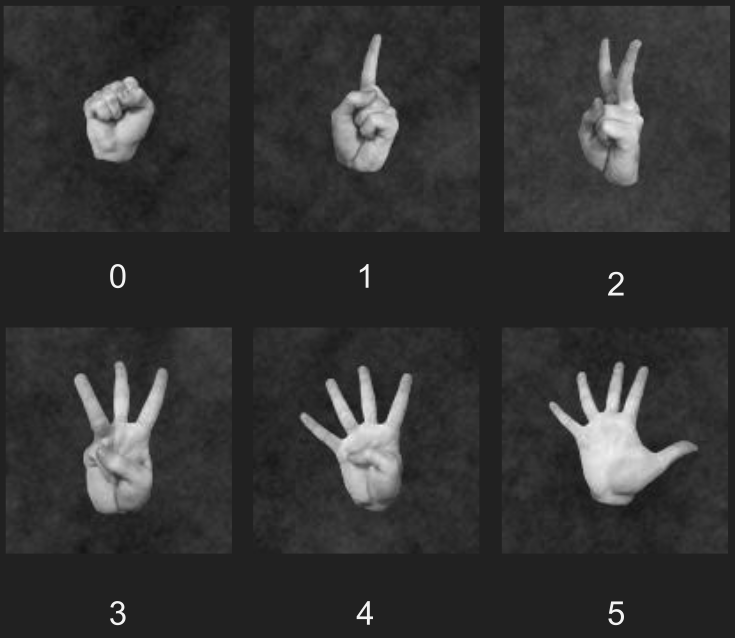

# Convolutional Neural Networks with Keras applied to Finger-counting Gestures

In this project we compare two custom architectures of Convolutional Neural Network (CNN) to classify correctly a dataset of images.

The complete implementation with model implementation, training, data augmentation and inference is included in the Python Notebooks included in this repository at the directories `CarlosNET/` and `IvanNET/`.

There is also a complete [report in Spanish](documents/IA-2020-keras-finger-counting-classification_es.pdf) detailing all the work done as well as some [slides in Spanish](documents/IA-defense-30-06-2020_es.pdf).

## Dataset: Finger-counting Gestures

The dataset was composed of 21600 images, each with dimensions 128x128. Images are labeled in 6 possible classes, each representing a different quantity with finger-counting gestures. The dataset was divided in 3:

* Training set: 4/6 of the dataset (14400 images)
* Validation set: 1/6 of the dataset (3600 images)
* Test set: 1/6 of the dataset (3600 images)



### Data Augmentation

As the dataset was very homogeneous, with not a lot of variability, the models fit very quickly. Thus, we applied some data augmentation to the base dataset. As part of the project, we wanted to include a comparison between training with and without the augmented dataset.

Transformations include:

* Vertical and horizontal flip
* Up to 90º rotations
* Vertical and horizontal flip up to 20% 
* Zoom in/out up to 20%


## Models

Both models were named as the authors of this project but we hope it does not come as too egocentric. 

This problem is not too complex, so these models didn't need to be too big.

The input for both models is a 128x128x1 tensor, as all images from the dataset are in grayscale. As this was a classification problem, the **output is a vector of 6 values from 0 to 1** representing the probability of being part of each of the classes. The Last layer uses the Softmax function to distribute the probability for each class.

### CarlosNET

Inspiration from this model came from LeNet-5 and it has **around 8 000 training parameters**.


The code for implementing this architecture Keras is the following:

```python
from keras import layers
from keras import models

model = models.Sequential()
model.add(layers.Conv2D(4,(3,3),activation='relu',input_shape=(128,128,1)))
model.add(layers.MaxPooling2D((3, 3)))
model.add(layers.Conv2D(8,(5,5),activation='relu'))
model.add(layers.MaxPooling2D((3, 3)))
model.add(layers.Conv2D(16, (7,7), activation='relu'))
model.add(layers.MaxPooling2D((2, 2)))

model.add(layers.Flatten())
model.add(layers.Dense(6, activation='softmax'))

model.summary()
```

### IvanNET

Inspiration from this model came from VGG16 and it has **around 6 160 000 training parameters**.


The code for implementing this architecture Keras is the following:

```python
from keras import layers
from keras import models

model = models.Sequential()
model.add(layers.Conv2D(20,(5,5),activation='relu',input_shape=(128,128,1)))
model.add(layers.Conv2D(20,(5,5),activation='relu'))
model.add(layers.MaxPooling2D((2, 2)))
model.add(layers.Conv2D(40,(3,3),activation='relu'))
model.add(layers.Conv2D(40,(3,3),activation='relu'))
model.add(layers.MaxPooling2D((2, 2)))
model.add(layers.Conv2D(80, (3, 3), activation='relu'))
model.add(layers.Conv2D(80, (3, 3), activation='relu'))
model.add(layers.Conv2D(80, (3, 3), activation='relu'))
model.add(layers.MaxPooling2D((2, 2)))


model.add(layers.Flatten())
model.add(layers.Dense(600, activation='relu'))
model.add(layers.Dense(300, activation='relu'))
model.add(layers.Dense(6, activation='softmax'))


model.summary()
```

## Training

As explained before, the dataset was very homogeneous so the models converged very quickly to optimal weight to classify images.

Final weights were obtained by **training through 30 epochs**. A file with weights for CarlosNET is available as `CarlosNET/carlosNet-aug-final.h5`.

|                       | Accuracy (train) | Accuracy (val) | Accuracy (test) |
| --------------------- | ---------------- | -------------- | --------------- |
| CarlosNet (augmented) | 0.9587           | 0.9586         | 0.9767          |
| IvanNet (augmented)   | 0.9823           | 0.9942         | 0.9955          |

Training was done in Google Collaboratory but some tries were done locally first.

### CarlosNET training

**Accuracy and Loss metrics** across all training epochs for both the training and validation sets. The **augmented dataset** was used in this case.


### IvanNET training

**Accuracy and Loss metrics** across all training epochs for both the training and validation sets. The **augmented dataset** was used in this case.


